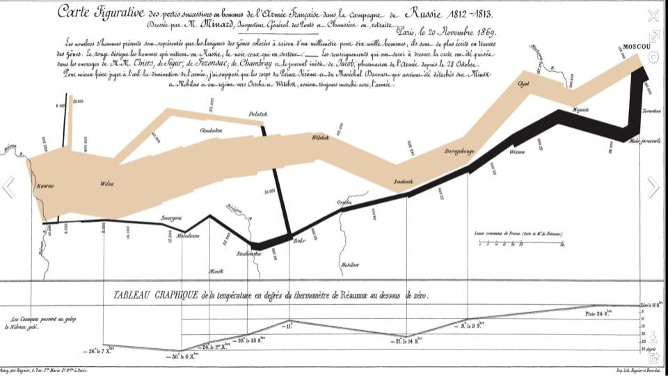
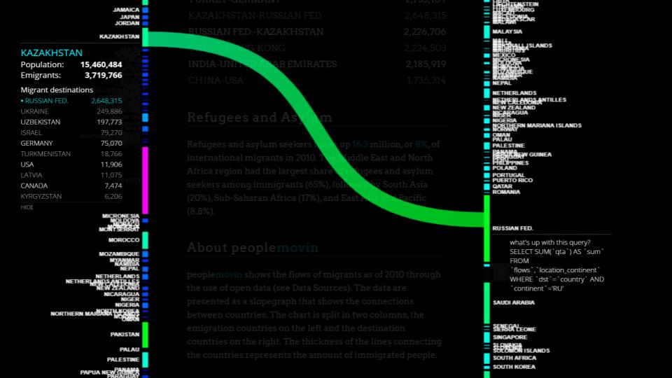
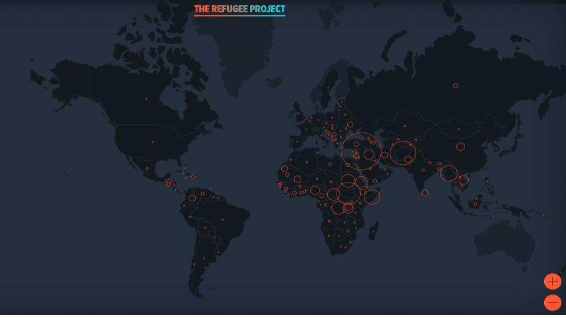
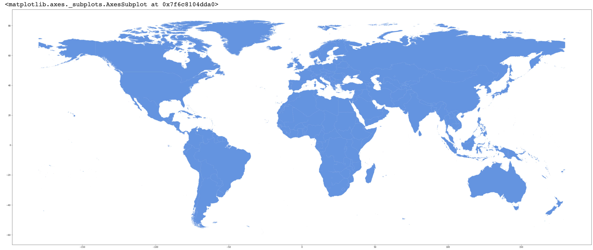
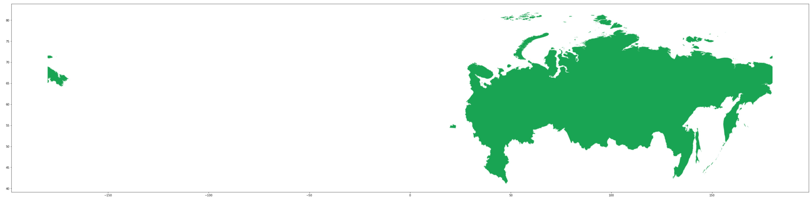
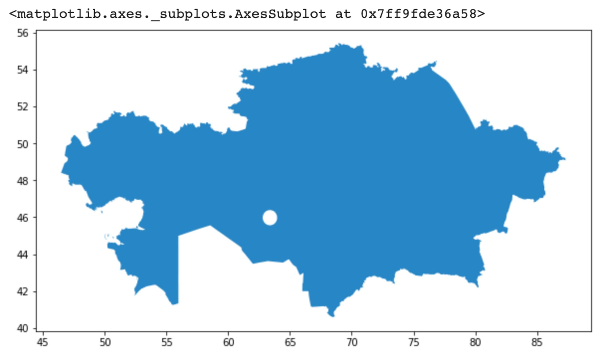
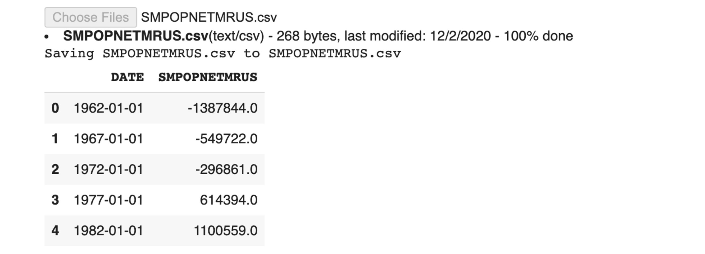
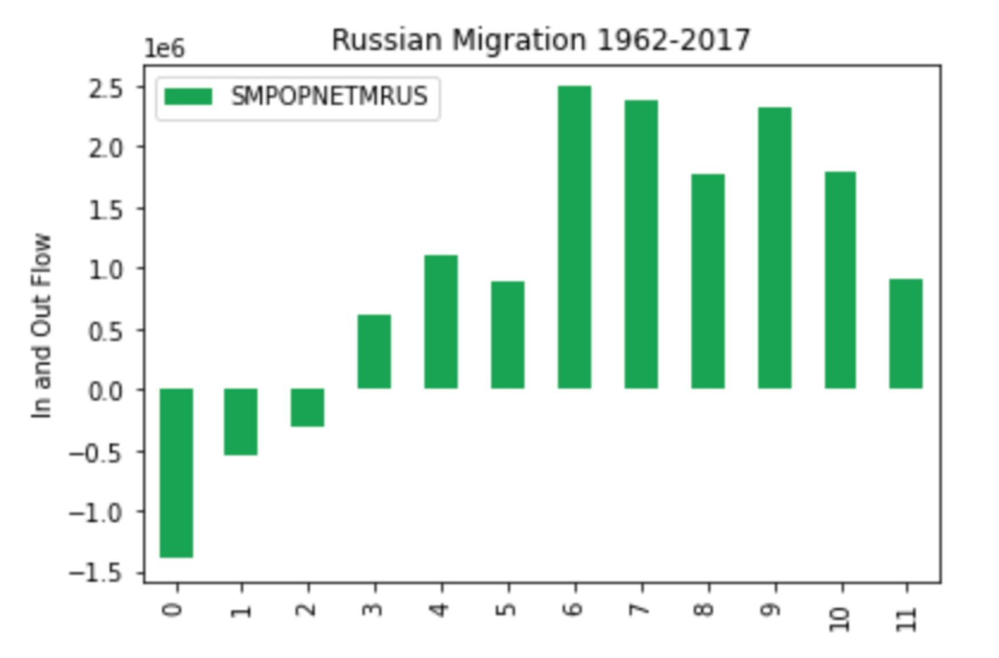
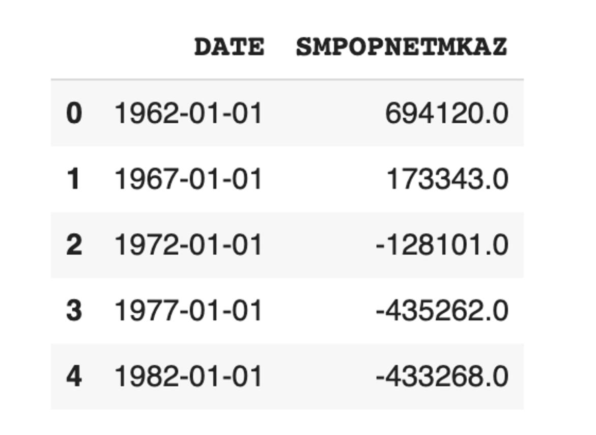
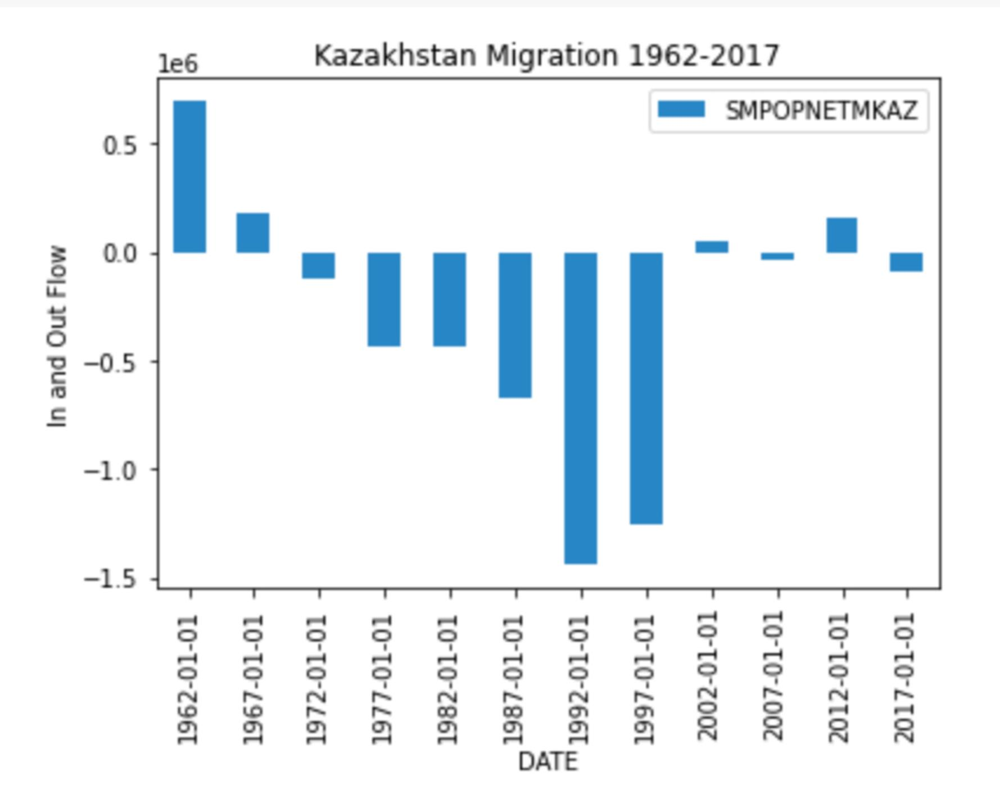

Geopandas is an extension of Pandas, which is an open source Python project for data analysis and visualization in Python. Began in 2008, a key feature is DataFrame objects, which are used to analyze data from a variety of formats (CSV, text, Excel, SQL, HDF5). GeoPandas empowers the GIS-minded Python programmer and “extends the datatypes used by Pandas to allow spatial operations on geometric types. Geometric operations are performed by shapely. Geopandas further depends on fiona for file access and descartes and matplotlib for plotting.” With Geopandas, you can do many GIS tasks, including make a map, analyze geospatial data, and merge data (akin to Lab 4).

My goal for this project was learn a new GIS-related technology so Geopandas stuck out to me as a great technology to explore. The basic data structures in GeoPandas are GeoSeries and GeoDataFrame (subclasses of Pandas Series and DataFrame).

But I also really like pandas….Even if they aren’t very interested in coding.


Duong Vu’s 2018 tutorial on DataCamp, [“Introduction to Geospatial Data in Python”](https://www.datacamp.com/community/tutorials/geospatial-data-python), helped tremendously, and its use of packages and techniques is what my project is developed from and extends upon.
Just to recap, spatial data is data that has as a core component a location denoted using a geographic coordinate system. This is often in latitude/longitude, but remember maps use projected coordinate systems and always have some level of distortion. That tutorial plots the course of Hurricane Florence, which connected to my interest in visualizing a phenomena in motion. 

Technology has to be used for something, and my geographic interest centers on Russia and Central Asia, so I decided to plot migration patterns in the region via graph. After the fall of the Soviet Union, many ethnic Russians in Kazakhstan immigrated to Russia, to the point where while in 1991 only 40% of the nation was ethnically Kazakh, that figure now stands at almost 70% This massive emigration is linked to dropping energy prices and the Kazakh economy, but also, more broadly and perhaps enduringly, due to ethnic tensions. Many Russians who leave are skilled professionals and want to return to their ancestral homeland. Relatedly, 90% of the almost 1 million new Kazakhstani citizens since 1992 are ethnic Kazakhs ([The Diplomat](https://thediplomat.com/2016/02/why-are-russians-leaving-kazakhstan/)).

Mapping and visualizing migration and movement is hard and has been done in several ways over the years.


Charles Joseph Minard's 19th century map showing the movement of Napoleon's troops into and back out of Russia, along with the temperature of locations along the way.


Visualization of recent migration between countries.


Web map of global refugee movement.

My contribution to this rich body of work uses Geopandas and Pandas to visualize the countries of Russia and Kazakhstan and plot bar graphs showing net migration for each country between 1962 and 2017. The migration data comes from [the Federal Reserve Bank of St. Louis](https://fred.stlouisfed.org/tags/series?t=migration) and all necessary data can be downloaded in the `data` file above. You will also need a [Google Colab](https://colab.research.google.com) account to import the projects the way I did. Other coding environments will work too, ideally a [Jupyter Notebook](https://jupyter.org) so you can view everything in one place. The instructions include screen shots of several key outputs, but the entire script can be seen and run in [this Colab notebook](https://colab.research.google.com/drive/15FtExkiTSgxkJ-zsCVtVyUXtGfeyz6K3?usp=sharing).

## Tutorial Instructions

First, install Geopandas to Colab.
```
!pip install GeoPandas
```

Next, import several other useful packages.

```
import numpy as np
import pandas as pd
from shapely.geometry import Point
import csv
import matplotlib.pyplot as plt
import matplotlib.pyplot as plt
import matplotlib.dates as mdates
% matplotlib inline
```

When I had trouble getting Geopandas to run, I used iterative development to check the status.

```
import sys
'geopandas' in sys.modules
```

A `True` return means Geopandas is working.

Upload `countries.geojson` using Colab's import files method. This format holds geographic and attribute data, in this case of the world's countries.

```
from google.colab import files
uploaded = files.upload()
```

The attibute data can be reviewed by reading the file with Geopandas. `.head()` shows the top of the dataset.

```
countries = geopandas.read_file("countries.geojson")
countries.head()
```

Plot the world save Antarctica, which is distorted and not necessary for this project, using `False` logic for that one case of `"ADMIN"`.
(To pick a different colors for your maps and graphs, go to [htmlcolorcodes.com](www.htmlcolorcodes.com) and copy the hex code for a selected color.)

```
countries[countries['ADMIN'].isin(['Antarctica']) == False].plot(figsize=(50,40), color='#6493DF')
```


To limit the map to just Russia, make the chosen `'Admin'` of Russia be `True.`

```
countries[countries['ADMIN'].isin(['Russia']) == True].plot(figsize=(50,40), color='#18A351')
```



Similarly, we can limit the map to just Kazakhstan.

```
countries[countries['ADMIN'].isin(['Kazakhstan']) == True].plot(figsize=(40,30), color='#2786C4')
```


Next we will make the graphs. The migration data is in csv, comma-separated value, format. This is very common and easily read with Pandas.
First, upload and read the Russian data in the file `SMPOPNETMRUS.csv.`

```
from google.colab import files
uploaded = files.upload()
russiadata = pd.read_csv('SMPOPNETMRUS.csv')
russiadata.head()

```



Each row starts with the line's index. To view the data type, run this code:

```
type(russiadata)
```

The output is `pandas.core.frame.DataFrame.`


After that, replace the index start with the date information so that will become the graph's x-axis.

```
russiadata.set_index("DATE", inplace = True)
russiadata.head()
```

And then, it is time to plot a graph! Again, any hex color can be used.
 
 ```
russiadata.plot(kind='bar',color='#18A351')
plt.title('Russian Migration 1962-2017')
plt.ylabel('In and Out Flow')
plt.show()
```



We will then upload, read, re-format, and plot the migration data for Kazakhstan using the file `SMPOPNETMKAZ.csv` and the same techniques as used on the Russian data so the two countries's migration trends can be compared.

Import and read the file.
```
from google.colab import files
uploaded = files.upload()
kazakdata = pd.read_csv('SMPOPNETMKAZ.csv')
kazakdata.head()
```


Set the x-axis to `"DATE"` via `.set_index.`

```
kazakdata.set_index("DATE", inplace = True) 
kazakdata.head()
```

Plot the data.

```
kazakdata.plot(kind='bar',color='#2786C4')
plt.title('Kazakhstan Migration 1962-2017')
plt.ylabel('In and Out Flow')
plt.show()
```


And you're done! You have learned how to import GeoJSON and csv files, review data, plot maps, and create graphs showing migration trends. Thank you for your time and please e-mail me at gpappalardo[@]clarku.edu with any feedback or ideas about migration mapping and visualization.

## Credits

Key aspect of this tutorial and several parts of the code syntax come from the following sources:

[DataCamp Tutorial discussed above](https://www.datacamp.com/community/tutorials/geospatial-data-python) (code syntax, particularly with regards to GeoPandas)

[DataHub](https://datahub.io/core/geo-countries) (`countries.geojson` code syntax)

[Python for Engineers](https://www.pythonforengineers.com/introduction-to-pandas/)(reading csv files and changing indexing)
