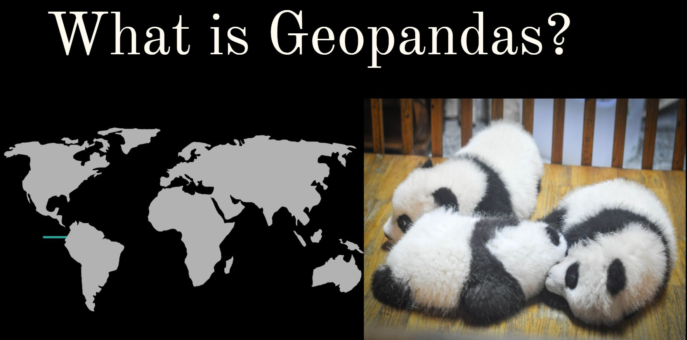

# geopandas-migration-tutorial

No pandas were harmed in the making of this tutorial. 
Geopandas is an extension of Pandas, which is an open source Python project for data analysis and visualization in Python. Began in 2008, a key feature is DataFrame objects, which are used to analyze data from a variety of formats (CSV, text, Excel, SQL, HDF5). GeoPandas empowers the GIS-minded Python programmer and “extends the datatypes used by Pandas to allow spatial operations on geometric types. Geometric operations are performed by shapely. Geopandas further depends on fiona for file access and descartes and matplotlib for plotting.” With Geopandas, you can do many GIS tasks, including make a map, analyze geospatial data, and merge data (akin to Lab 4).

My goal for this project was learn a new GIS-related technology so Geopandas stuck out to me as a great technology to explore. The basic data structures in GeoPandas are GeoSeries and GeoDataFrame (subclasses of Pandas Series and DataFrame).

But I also really like pandas….Even if they aren’t very interested in coding.

Duong Vu’s 2018 tutorial on DataCamp called [“Introduction to Geospatial Data in Python”](https://www.datacamp.com/community/tutorials/geospatial-data-python) helped tremendously, and its use of packages and techniques is what my project is developed from and extends upon.
Just to recap, spatial data is data that has as a core component a location denoted using a geographic coordinate system. This is often in latitude/longitude, but remember maps use projected coordinate systems and always have some level of distortion. That tutorial plots the course of Hurricane Florence, which connected to my interest in visualizing something in motion. 

Now, technology has to be used for something, and my geographic interest centers on Russia and Central Asia. Therefore, I decided to plot migration patterns in the region via graph. After the fall of the Soviet Union, many ethnic Russians in Kazakhstan immigrated to Russia, to the point where while in 1991 only 40% of the nation was ethnically Kazakh, that figure now stands at almost 70% (The Diplomat).
This massive emigration is linked to dropping energy prices and the Kazakh economy, but also, more broadly and perhaps enduringly, due to ethnic tensions. Many Russians who leave are skilled professionals, and they in general want to return to their ancestral homeland. Relatedly, 90% of the almost 1 million new Kazakhstani citizens since 1992 are ethnic Kazakhs ([The Diplomat](https://thediplomat.com/2016/02/why-are-russians-leaving-kazakhstan/)).

Mapping and visualizing migration and movement is hard and has been done in several ways over the years.

